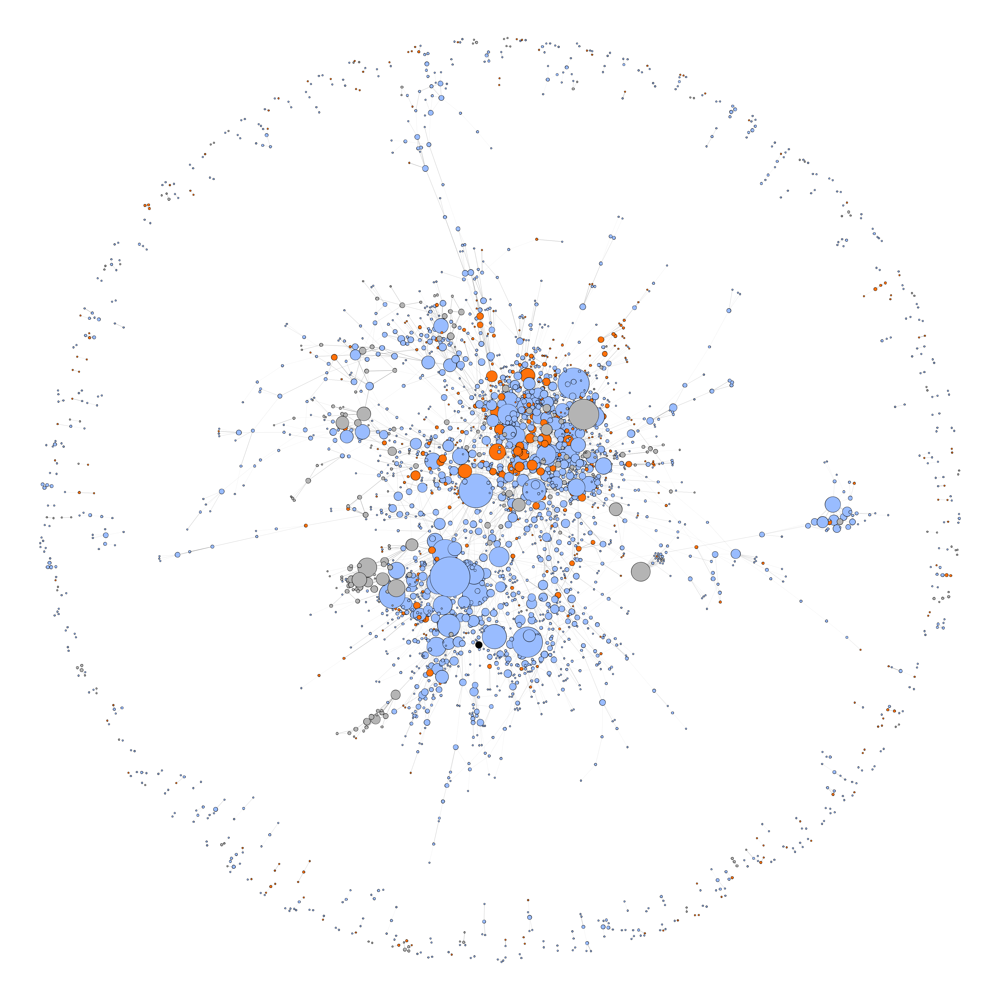

# Introduction
Biodiversity data are collected by people, and those people often work in teams. Those teams may be large, particular when they are part of an expedition, though they maybe as small as two people. Data of who works together can help refine biodiversity data in many ways. It can help us cross-reference data to ensure it is consistent and valid. It helps us acknowledge the contribution to science of all of the participants. It helps us understand how scientific collection, learning and communication operates and this can give us insights into the biases and effectiveness of the collection process. Also, the relationships between people, and the organisations they are members of, are interesting from a historic and sociological perspective.

Network analysis has been used for some time to explore the relationships between people, but the connections analysed maybe strong, as in the case of citation networks where the cooportion between people is long term, or weak in the case of Twitter analytics, that takes only a mouse click to like a tweet. Here we specifically analyse the co-collection of biological specimens by people. Co-collecting a specimen requires that those people involved in the collection process travel, organise and explore together. One could argue that such a connection could be even stronger than co-authoring a publication together, though doubtlessly the degree of engagement varies considerable. Networks based upon co-collection have been creating before for specific groups, for example to analyse the botanical exchange clubs of the United Kingdom [@groom2014herbarium] and for a specific herbarium [@de2020new]. However, in this paper we approach the co-collection networks from a global perspective using the data from [Bionomia](https://bionomia.net/). Bionomia is a community based project that allows users to associate stable identifiers for people, such as [ORCID](https://orcid.org/) and [Wikidata Q numbers](https://www.wikidata.org/wiki/Q43649390), to the anonymous text strings transcribed from specimens in museum and herbaria.

# Methods

## Data sources
Data on collectors were downloaded from the Bionomia website (2021-11-06). This comma separated file contains three columns (Subject,Predicate,Object), the URI of the GBIF id of the specimen, the identifier of the Darwin Core term (recordedBy or identifiedBy) and the person identifier (ORCID or Wikidata Q number). This file was imported into a table in an SQLite database [@sqlite2020hipp]. All rows referring to identifications of specimens were deleted, leaving only those related to specimen collection. A query was then run using a self-join on specimen ID to create a new table containing two rows with pairs of collectors that collected with each other. This table was then exported and the number of specimens was calculated per collector pair, to create a file of network edges with the pairs of collectors and a weight based on the number of specimens they had in common.

Demographic and gender information on the collectors was retrieved from Wikidata using the notebook 'get_collector_gender.ipynb'. Using the SPARQL endpoint of Wikidata, the script is collecting the relevant information if it is available. ORCiD records not containing gender or demographic information. Therefor we can only retrieve the information if those people are represented in Wikidata and their ORCiD is present in the Wikidata entry. The output of the script creates a nodes file containing the ID of the person and columns for the gender and demographic information.

Using the network edges and the nodes list, the Jupyter notebook 'age_differences.ipynb' starts with filtering out the unique interactions between people. Using the demographic information, it was possible to derive the age differences between the interacting people. This can serve as a metric to filter out wrong connections between people. As such it is possible to detect wrong assignments of people to specimens and can help clean the data. Since in many cases gender could be retrieved from the identifiers, it also enabled the analysis of gender as parameter in the network of people.

## Collector network visualization
To visualize the network the nodes and edges file was imported into Gephi [@ICWSM09154] as an undirected network with weighted edges. The network was laid out using the Yifan Hu algorithm [@hu2011algorithms]. The weight of the edges was equal to the number of specimens a collector pair collected together (not shown in Fig. 1). 

# Results

## The network of collectors
The network contains 3009 nodes and 4330 edges (Fig. 1). The average degree is 2.88. The average modularity of the network [@Blondel2008] is 0.84. The analysis identified 327 communities. The top five of largest clusters with their characteristics is shown in Table 1. The total diameter of the largest network is 22 and the average path length 6.99 [@Brandes2001]. The data gathered from Wikidata also includes the gender of the person, therefore we are able to analyse the network for gender differences in co-collecting. This has been visulized in figure 2.

![The network of collector collaborations for specimens identified in Bionomia (https://bionomia.net/). This was created in Gephi [@ICWSM09154]. The size of the nodes is determined by the degree of the node (i.e. number of people they collected with) and the colours of the nodes is determined by a community detection algorithm and coloured for the largest modules within the network [@blondel2008fast]](./figures/CollectorsNetwork_Degree-final.png)

Most people collaborate with only with one person, but there are some super-co-collectors who collaborate with many people. The top three men and women with the highest number of collectors is listed in table 1. However, men tend to have many more co-collectors than women (Fig. 3).

Table 1: The top three men and women with the largest number of co-collectors, ordered alphabetically by their surnames

|Wikipedia|Wikidata|
|---|---|
|[Elizabeth Gertrude Britton](https://en.wikipedia.org/wiki/Elizabeth_Gertrude_Britton)|[Q2567402](https://www.wikidata.org/wiki/Q2567402)|
|[Merritt Lyndon Fernald](https://en.wikipedia.org/wiki/Merritt_Lyndon_Fernald)|[Q2656885](https://www.wikidata.org/wiki/Q2656885)|
|[Johannes Lid](https://en.wikipedia.org/wiki/Johannes_Lid)|[Q94522](https://www.wikidata.org/wiki/Q94522)|
|[Alicia Lourteig](https://en.wikipedia.org/wiki/Alicia_Lourteig)|[Q454806](https://www.wikidata.org/wiki/Q454806)|
|[Elisa G. Nicora](https://en.wikipedia.org/wiki/Elisa_G._Nicora)|[Q5829538](https://www.wikidata.org/wiki/Q5829538)|
|[William Alfred Weber](https://en.wikipedia.org/wiki/William_Alfred_Weber)|[Q4105706](https://www.wikidata.org/wiki/Q4105706)|

After analysis through the age differences notebook, a histogram of the age differences could be constructed for the different gender combinations (Fig.4). The distribution of age differences suggests that the cut-off of realistic differences in ages is around 50 years. Also intuitively it seems reasonable to assume that it is worthwhile checking the records that show a bigger differnce in age. The fraction of edges that should be investigated further is around 5.5%. This is a significant number of records that could be fedback to Bionomia to be checked and corrected by the community.

The number of specimens collected shows a clear increase during the course of time. The beginning of the records shows a pure male-male gender combination in the collection of the specimens. In the late 18th century the first specimens were collected by mixed gender teams and it takes until the beginning of the 19th century that female only collecting teams are showing up in the data. In the 20th century, the pure male collecting teams are dropped below 70% and still decreasing.

# Discussion and/or Conclusion
Given that there are around 2 billion specimens in natural history collections worldwide [@arino2010approaches], and only a small propoortion of those have been full digitized and linked to identifiers for their collectors 

## Communication and outreach
Given our results on women in science we thought we would take the oppurtunity to highlight the work of three of the highly connected female collectors. Below are the infographics we made and the texts we tweeted on these women. More information can be found about these women in these publications [@Fosberg1959; @sastre2003alicia; @Fuglei2006].

Tweet: French–Argentinian botanist Alicia Lourteig has about 20 plant taxa named after her.

Tweet: Mary Chase was the first woman elected to the presidency of the Botanical Society of America. She was also a committed suffragist, and was always supporting women in their scientific studies. 

Tweet: Hanna Resvoll-Holmsen was a pioneer conservationist and ecologist, advocating for the preservation of natural ecosystems in her paper Om betydningen av det uensartede i våre skoger

Also the tweets included the hashtags #WomenInScience #STEMWomen & #BioHackEU21

# Future work

As more data becomes available there is considerable scope for repeating this project in the future. We do not anticipate the general trends to change, but we will be able to study the network, and its various subnetworks in much more detail. It may also be valuable to compare these collection networks with citation and co-authorship networks.
Networks, such as these, will help us understand the provenance of collections, and the biases they contain, thus improving the overall metadata of collections. It would also be useful to collaborate with historians and social scientists to get a different perspective on what these networks tell us about people.

# Jupyter notebooks, GitHub repositories and data repositories

# Acknowledgements
The authors thank the organizers BioHackathon-Europe for their support and excellent organisation. This work was also facilitated by the Research Foundation – Flanders research infrastructure under grant number FWO I001721N and the BiCIKL project of the European Union's Horizon 2020 Research and Innovation action under grant agreement No 101007492.

# References
